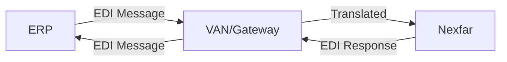

## Visão Geral

A integração via EDI (Electronic Data Interchange) permite a troca padronizada de documentos eletrônicos entre o ERP e a plataforma Nexfar. Este método é ideal para empresas que já possuem infraestrutura EDI estabelecida.

<Note>
  **Documentação em desenvolvimento:** Esta seção será expandida com especificações detalhadas dos layouts EDI. Entre em contato com a equipe Nexfar para mais informações.
</Note>

---

## O que é EDI?

EDI (Electronic Data Interchange) é um padrão para troca automatizada de documentos comerciais em formato estruturado, eliminando a necessidade de processamento manual.

### Vantagens

<CardGroup cols={2}>
  <Card title="Padronização" icon="check">
    Formatos amplamente adotados no mercado
  </Card>

  <Card title="Auditoria" icon="shield">
    Rastreabilidade completa de transações
  </Card>

  <Card title="Automação" icon="robot">
    Processamento sem intervenção manual
  </Card>

  <Card title="Confiabilidade" icon="handshake">
    Protocolos estabelecidos e testados
  </Card>
</CardGroup>

---

## Padrões Suportados

A Nexfar pode trabalhar com os seguintes padrões EDI:

### EDIFACT

Padrão internacional para documentos comerciais.

**Documentos suportados:**
- ORDERS (Pedidos)
- ORDRSP (Resposta de pedidos)
- DESADV (Aviso de despacho)
- INVOIC (Fatura)

### X12

Padrão norte-americano adaptado para o Brasil.

**Transações suportadas:**
- 850 (Purchase Order)
- 855 (Purchase Order Acknowledgment)
- 856 (Ship Notice/Manifest)
- 810 (Invoice)

### Padrões Customizados

Layouts específicos por distribuidor podem ser negociados.

---

## Fluxo de Comunicação



### Componentes

1. **ERP**: Sistema de origem dos dados
2. **VAN/Gateway**: Rede de valor agregado ou gateway de tradução
3. **Nexfar**: Plataforma receptora

---

## Documentos EDI

### Pedidos (ORDERS / 850)

**Direção:** Nexfar → ERP

Pedidos realizados na plataforma Nexfar são enviados ao ERP via EDI.

**Conteúdo:**
- Dados do cliente
- Itens do pedido
- Condições de pagamento
- Endereço de entrega

### Confirmação de Pedido (ORDRSP / 855)

**Direção:** ERP → Nexfar

Confirmação e status do pedido após processamento no ERP.

**Conteúdo:**
- Status de aceitação
- Quantidades confirmadas
- Previsão de entrega
- Motivos de não atendimento

### Aviso de Despacho (DESADV / 856)

**Direção:** ERP → Nexfar

Notificação de que o pedido foi despachado.

**Conteúdo:**
- Dados de transporte
- NFe vinculada
- Rastreamento
- Previsão de entrega

### Fatura (INVOIC / 810)

**Direção:** ERP → Nexfar

Informações da nota fiscal emitida.

**Conteúdo:**
- Dados da NFe
- Valores fiscais
- Duplicatas
- Chave de acesso

---

## Requisitos Técnicos

### Conexão

- **VAN (Value-Added Network):** Rede privada para troca EDI
- **AS2:** Protocolo seguro sobre internet
- **SFTP:** Transferência segura de arquivos

### Formato de Arquivos

- **Encoding:** UTF-8 ou ISO-8859-1
- **Delimitadores:** Configuráveis conforme padrão
- **Compressão:** Opcional (ZIP, GZIP)

### Frequência de Transmissão

- **Pedidos:** Tempo real ou a cada 15 minutos
- **Status:** A cada hora
- **Notas fiscais:** Tempo real após emissão

---

## Nomenclatura de Arquivos

Padrão sugerido para nomes de arquivo:

```
{TIPO}_{REMETENTE}_{DESTINATARIO}_{DATA}_{HORA}_{SEQUENCIAL}.edi

Exemplo:
ORDERS_NEXFAR_DISTRIB_20241028_143025_001.edi
ORDRSP_DISTRIB_NEXFAR_20241028_150000_001.edi
```

---

## Mapeamento de Dados

### Exemplo: Cliente

| Campo Nexfar | Segmento EDIFACT | Campo X12 |
| --- | --- | --- |
| `cnpj` | NAD+BY+{cnpj}::91' | N1*BY*{cnpj}*91~ |
| `name` | NAD+BY+{id}::92++{name}' | N1*BY*{id}*92~ |
| `address` | NAD+BY+++{address}' | N3*{address}~ |

<Note>
  Mapeamentos detalhados serão fornecidos durante a implementação.
</Note>

---

## Controle de Qualidade

### Validações

Todos os documentos EDI devem passar por:

1. **Validação sintática:** Estrutura do documento
2. **Validação semântica:** Conteúdo e regras de negócio
3. **Validação referencial:** Integridade entre documentos

### Mensagens de Erro

Erros são reportados via:

- **CONTRL (EDIFACT):** Mensagem de controle
- **997 (X12):** Functional Acknowledgment

---

## Monitoramento

### Indicadores

- **Taxa de sucesso:** % de documentos processados com sucesso
- **Tempo médio:** Tempo entre envio e confirmação
- **Rejeições:** Documentos rejeitados e motivos

### Alertas

Configure alertas para:

- Falhas de transmissão
- Documentos rejeitados
- Atrasos no processamento

---

## Implementação

### Passos

1. **Análise de viabilidade:**
   - Verificar infraestrutura EDI existente
   - Identificar VAN ou gateway disponível
   - Definir padrão EDI (EDIFACT/X12)

2. **Mapeamento:**
   - Mapear campos do ERP para segmentos EDI
   - Validar regras de negócio
   - Definir tratamento de exceções

3. **Desenvolvimento:**
   - Implementar geração de mensagens EDI
   - Configurar envio/recebimento
   - Desenvolver parsers de resposta

4. **Testes:**
   - Ambiente de homologação
   - Casos de sucesso e erro
   - Volume e performance

5. **Produção:**
   - Migração gradual
   - Monitoramento intensivo
   - Suporte disponível

---

## Custos

### VAN (Value-Added Network)

- Taxa de setup: Variável
- Taxa mensal: Por volume de transações
- Taxa por documento: Alguns centavos por transação

### Gateway EDI

- Licença de software
- Manutenção anual
- Suporte técnico

<Info>
  A Nexfar pode indicar parceiros VAN e gateways EDI certificados.
</Info>

---

## Próximos Passos

1. Avaliar infraestrutura EDI atual
2. Escolher padrão EDI (EDIFACT/X12/Custom)
3. Definir VAN ou gateway
4. Solicitar especificações detalhadas à Nexfar
5. Agendar reunião de alinhamento técnico

<Warning>
  A implementação de EDI requer planejamento detalhado. Entre em contato com antecedência para garantir prazos adequados.
</Warning>

---

## Suporte

Para mais informações sobre integração EDI:

- Email: integracao@nexfar.com.br
- Telefone: (11) 1234-5678
- Solicite documentação específica do padrão EDI desejado
