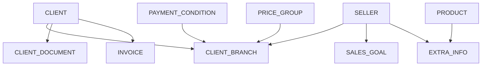

## Visão Geral

Esta categoria agrupa VIEWs relacionadas a documentos fiscais, documentação de clientes, metas de vendas e outras informações complementares necessárias para o funcionamento completo da plataforma.

---

## VIEW_NEXFAR_INVOICE

Duplicatas e notas fiscais de clientes para exibição no portal.

### Descrição

Permite que os clientes visualizem suas duplicatas, boletos e notas fiscais diretamente na plataforma Nexfar.

### Campos Principais

| Campo Nexfar | Descrição | Tipo | Obrigatório |
| --- | --- | --- | --- |
| `externalId` | ID da duplicata no ERP | VARCHAR(255) | SIM |
| `clientId` | ID do cliente no ERP | VARCHAR(255) | SIM |
| `cnpj` | CNPJ do cliente | VARCHAR(20) | SIM |
| `warehouseId` | ID do Centro de Distribuição | VARCHAR(255) | SIM |
| `orderId` | ID do pedido na Nexfar | VARCHAR(255) | NÃO |
| `orderExternalId` | ID do pedido no ERP | VARCHAR(255) | NÃO |
| `branchId` | ID da Base | VARCHAR(255) | NÃO |
| `ourNumber` | Número identificador do boleto | VARCHAR(255) | NÃO |
| `emissionDate` | Data de emissão | DATE | NÃO |
| `dueDate` | Data de vencimento | DATE | NÃO |

<Info>
  Clientes podem consultar duplicatas em aberto, vencidas e pagas através do portal.
</Info>

---

## VIEW_CLIENT_DOCUMENT

Documentação regulatória dos clientes (ANVISA, CRF, VISA, etc.).

### Descrição

Gerencia a documentação necessária para que clientes possam adquirir produtos controlados ou restritos.

### Campos Principais

| Campo Nexfar | Descrição | Tipo | Obrigatório |
| --- | --- | --- | --- |
| `clientId` | ID do cliente no ERP | VARCHAR(255) | SIM |
| `cnpj` | CNPJ do cliente | VARCHAR(20) | SIM |
| `type` | Tipo do documento | VARCHAR(50) | SIM |
| `status` | Status: REGULAR ou VENCIDO | VARCHAR(50) | SIM |
| `value` | Número do documento | VARCHAR(255) | NÃO |
| `validUntil` | Data de validade | DATE | NÃO |

### Tipos de Documentos

Exemplos comuns:
- `ANVISA`: Autorização ANVISA
- `CONTROLADO`: Licença para produtos controlados
- `CRF`: Registro no Conselho Regional de Farmácia
- `VISA`: Autorização da Vigilância Sanitária
- `ALVARA`: Alvará de funcionamento

<Warning>
  Documentos vencidos (`status = VENCIDO`) podem bloquear a compra de produtos que requerem a documentação.
</Warning>

---

## VIEW_NEXFAR_CLIENT_BRANCH

Vincula clientes às bases com suas configurações comerciais.

### Descrição

Esta VIEW é fundamental para definir as regras comerciais específicas de cada cliente em cada base/CD.

### Campos Principais

| Campo Nexfar | Descrição | Tipo | Obrigatório |
| --- | --- | --- | --- |
| `clientId` | ID do cliente no ERP | VARCHAR(255) | SIM |
| `cnpj` | CNPJ do cliente | VARCHAR(20) | SIM |
| `branchId` | ID da Base | VARCHAR(255) | SIM |
| `warehouseId` | ID do Centro de Distribuição | VARCHAR(255) | SIM |
| `priceGroupId` | ID da tabela de preço | VARCHAR(255) | SIM |
| `sellerId` | ID do vendedor | VARCHAR(255) | NÃO |
| `mainSeller` | É vendedor principal? | BOOLEAN | NÃO |
| `module` | Canal: NEXON, NEXOFF | VARCHAR(50) | SIM |
| `paymentConditions` | IDs de condições (ex: 10/13/19) | VARCHAR(255) | NÃO |
| `orderMinValue` | Valor mínimo do pedido | NUMERIC(10,2) | SIM |
| `mediumTerm` | Prazo médio de pagamento | INTEGER | NÃO |
| `taxFree` | Isento de ST? | BOOLEAN | NÃO |
| `clientTaxCode` | Código de agrupamento fiscal | VARCHAR(255) | NÃO |

<Tip>
  **Campo `paymentConditions`:** Lista de IDs separados por `/` que fazem referência aos IDs da VIEW_NEXFAR_PAYMENT_CONDITION.
</Tip>

---

## VIEW_NEXFAR_SALES_GOAL

Metas de vendas por vendedor/período.

### Descrição

Define metas comerciais para vendedores e permite acompanhamento de performance.

### Uso

Utilize esta VIEW para:
- Definir metas mensais/trimestrais de vendedores
- Acompanhar performance de vendas
- Configurar comissionamento por atingimento de meta
- Gerar relatórios gerenciais

<Note>
  Esta VIEW é opcional e específica para clientes que trabalham com metas estruturadas de vendas.
</Note>

---

## VIEW_NEXFAR_GENERIC_EXTRA_INFO

Informações extras de produtos positivados pelo vendedor.

### Descrição

Dados complementares sobre produtos no contexto de base, CD, vendedor específico.

### Campos Principais

| Campo Nexfar | Descrição | Tipo | Obrigatório |
| --- | --- | --- | --- |
| `filter_branchId` | ID da Base | VARCHAR(255) | SIM |
| `filter_warehouseId` | ID do Centro de Distribuição | VARCHAR(255) | SIM |
| `filter_sellerId` | ID do vendedor | VARCHAR(255) | SIM |
| `filter_productId` | SKU do Produto | VARCHAR(255) | SIM |

<Info>
  **Uso avançado:** Esta VIEW é utilizada em cenários específicos de Força de Vendas. Consulte a equipe Nexfar para entender se aplica ao seu caso.
</Info>

---

## Relações entre VIEWs



---

## Fluxo de Uso

### Documentação de Clientes

1. Cliente se cadastra na plataforma
2. Sistema verifica `VIEW_CLIENT_DOCUMENT`
3. Se documentos necessários estão `REGULAR`, libera compra
4. Se `VENCIDO`, bloqueia produtos que requerem a documentação

### Consulta de Duplicatas

1. Cliente acessa área financeira
2. Sistema consulta `VIEW_NEXFAR_INVOICE`
3. Exibe duplicatas abertas, vencidas e pagas
4. Cliente pode baixar boletos e NFEs

### Configuração Comercial

1. Sistema identifica cliente + base
2. Consulta `VIEW_NEXFAR_CLIENT_BRANCH`
3. Aplica tabela de preço, condições de pagamento e valor mínimo
4. Libera produtos disponíveis para aquela configuração

---

## Exemplo de Consulta SQL

```sql
-- Exemplo: VIEW_NEXFAR_INVOICE
CREATE VIEW VIEW_NEXFAR_INVOICE AS
SELECT
    d.id AS externalId,
    c.id_erp AS clientId,
    c.cnpj AS cnpj,
    d.id_cd AS warehouseId,
    p.id_nexfar AS orderId,
    p.id_erp AS orderExternalId,
    d.nosso_numero AS ourNumber,
    d.data_emissao AS emissionDate,
    d.data_vencimento AS dueDate
FROM duplicatas d
INNER JOIN clientes c ON d.id_cliente = c.id
LEFT JOIN pedidos p ON d.id_pedido = p.id
WHERE d.status IN ('ABERTO', 'VENCIDO', 'PAGO');

-- Exemplo: VIEW_CLIENT_DOCUMENT
CREATE VIEW VIEW_CLIENT_DOCUMENT AS
SELECT
    c.id_erp AS clientId,
    c.cnpj AS cnpj,
    doc.tipo AS type,
    CASE
        WHEN doc.data_validade < CURRENT_DATE THEN 'VENCIDO'
        ELSE 'REGULAR'
    END AS status,
    doc.numero AS value,
    doc.data_validade AS validUntil
FROM documentos_cliente doc
INNER JOIN clientes c ON doc.id_cliente = c.id;
```

---

## Próximos Passos

Após implementar estas VIEWs:

1. Teste a consulta de duplicatas no portal do cliente
2. Valide os bloqueios por documentação vencida
3. Verifique as configurações comerciais por base
4. Configure metas de vendas se aplicável

<Note>
  Estas VIEWs complementam as demais categorias. Certifique-se de ter implementado [Cadastros Básicos](/deployment/data-extraction/views/cadastros-basicos) primeiro.
</Note>

---

## Documentação Adicional

Para mais detalhes sobre cada VIEW, consulte:

- Documentação completa no Google Docs (solicite acesso via equipe Nexfar)
- Confluence: [Campos para Integração](https://nexfar.atlassian.net/wiki/spaces/UP/pages/INTEGRATION)
- Suporte técnico: suporte@nexfar.com.br
