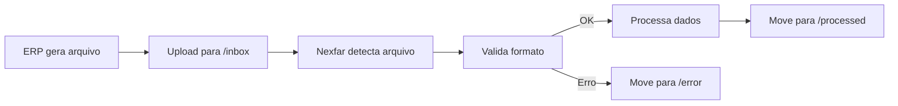

## Visão Geral

A integração via FTP permite a extração de dados através de arquivos em formato estruturado (CSV, TXT, XML) transferidos por protocolo FTP ou SFTP. Este método é ideal para processamento em lote e sistemas legados.

<Note>
  **Documentação em desenvolvimento:** Esta seção será expandida com especificações detalhadas dos layouts de arquivo. Entre em contato com a equipe Nexfar para mais informações.
</Note>

---

## Protocolos Suportados

### SFTP (Recomendado)

**Secure File Transfer Protocol**

- Transferência criptografada
- Autenticação por chave SSH
- Porta padrão: 22

<Info>
  **Recomendado:** SFTP oferece maior segurança e é o protocolo preferencial da Nexfar.
</Info>

### FTPS

**FTP Secure**

- FTP sobre SSL/TLS
- Criptografia de dados
- Portas: 21 (controle), 990 (implícito)

### FTP (Legado)

**File Transfer Protocol**

- Sem criptografia
- Apenas para ambientes controlados
- Porta padrão: 21

<Warning>
  FTP sem criptografia não é recomendado para dados sensíveis. Use apenas em redes privadas.
</Warning>

---

## Estrutura de Diretórios

Organize os arquivos na seguinte estrutura:

```
/nexfar/
├── inbox/          # Arquivos para a Nexfar processar
│   ├── clients/
│   ├── products/
│   ├── prices/
│   └── orders/
├── outbox/         # Arquivos gerados pela Nexfar
│   └── orders/
├── processed/      # Arquivos já processados (backup)
│   └── YYYY-MM-DD/
└── error/          # Arquivos com erro de processamento
```

---

## Formatos de Arquivo

### CSV (Recomendado)

**Características:**
- Delimitador: `;` (ponto e vírgula)
- Encoding: UTF-8
- Primeira linha: Headers (nomes dos campos)
- Aspas: Campos com delimitador devem usar `"`

**Exemplo:** `clients.csv`

```csv
externalId;name;cnpj;razaoSocial;state;city
12345;Farmacia Exemplo;12345678000190;Farmacia Exemplo Ltda;SP;São Paulo
67890;Drogaria Teste;98765432000110;Drogaria Teste SA;RJ;Rio de Janeiro
```

### TXT (Posicional)

**Características:**
- Campos com tamanho fixo
- Sem delimitadores
- Layout documentado por arquivo

**Exemplo:** `clients.txt`

```
12345Farmacia Exemplo      12345678000190SP
67890Drogaria Teste        98765432000110RJ
```

### XML

**Características:**
- Schema XSD documentado
- Encoding UTF-8
- Validação obrigatória

**Exemplo:** `clients.xml`

```xml
<?xml version="1.0" encoding="UTF-8"?>
<clients>
  <client>
    <externalId>12345</externalId>
    <name>Farmacia Exemplo</name>
    <cnpj>12345678000190</cnpj>
    <state>SP</state>
  </client>
</clients>
```

---

## Nomenclatura de Arquivos

### Padrão de Nomenclatura

```
{TIPO}_{DATA}_{HORA}_{SEQUENCIAL}.{ext}

Exemplos:
CLIENTS_20241028_140000_001.csv
PRODUCTS_20241028_140500_001.csv
PRICES_20241028_141000_001.csv
```

### Componentes

- **TIPO:** Tipo de dados (CLIENTS, PRODUCTS, ORDERS, etc.)
- **DATA:** YYYYMMDD (ano, mês, dia)
- **HORA:** HHMMSS (hora, minuto, segundo)
- **SEQUENCIAL:** Número sequencial (001, 002, ...)
- **EXT:** Extensão (.csv, .txt, .xml)

---

## Arquivos Necessários

### Cadastros Básicos

| Arquivo | Descrição | Frequência |
| --- | --- | --- |
| `CLIENTS_*.csv` | Clientes ativos | Diária |
| `PAYMENT_CONDITIONS_*.csv` | Condições de pagamento | Diária |
| `PRICE_GROUPS_*.csv` | Tabelas de preço | Diária |
| `SELLERS_*.csv` | Vendedores | Diária |

### Produtos

| Arquivo | Descrição | Frequência |
| --- | --- | --- |
| `PRODUCTS_*.csv` | Catálogo de produtos | Diária |
| `PRODUCT_PRICES_*.csv` | Preços por tabela | Diária |
| `PRODUCT_STOCK_*.csv` | Estoque por CD | A cada 1 hora |
| `PRODUCT_BRANCHES_*.csv` | Produtos por base | Diária |

### Pedidos

| Arquivo | Descrição | Frequência |
| --- | --- | --- |
| `ORDERS_*.csv` | Pedidos Nexfar | A cada 15 min |
| `ORDER_STATUS_*.csv` | Atualização de status | A cada 30 min |

---

## Fluxo de Processamento



### Processamento

1. **Geração:** ERP gera arquivo no formato acordado
2. **Upload:** Arquivo é enviado via SFTP para `/inbox/{tipo}/`
3. **Detecção:** Nexfar detecta novo arquivo (polling a cada 5 min)
4. **Validação:** Verifica formato, encoding e estrutura
5. **Processamento:** Importa dados para a plataforma
6. **Arquivo:** Move para `/processed/` ou `/error/`

### Controle de Processamento

Arquivo de controle: `.processed`

```
CLIENTS_20241028_140000_001.csv;2024-10-28 14:05:23;SUCCESS;150 registros importados
PRODUCTS_20241028_140500_001.csv;2024-10-28 14:10:15;SUCCESS;2500 registros importados
PRICES_20241028_141000_001.csv;2024-10-28 14:15:00;ERROR;Campo 'price' inválido na linha 45
```

---

## Tratamento de Erros

### Arquivo de Log

Para cada arquivo processado, gera-se um log:

```
CLIENTS_20241028_140000_001.log
```

**Conteúdo:**

```
[2024-10-28 14:05:20] INFO: Iniciando processamento
[2024-10-28 14:05:21] INFO: 150 linhas detectadas
[2024-10-28 14:05:22] WARN: Linha 45 - CNPJ inválido, registro ignorado
[2024-10-28 14:05:23] INFO: Processamento concluído - 149/150 sucesso
```

### Tipos de Erro

| Erro | Ação | Arquivo |
| --- | --- | --- |
| **Formato inválido** | Rejeita arquivo | Move para `/error/` |
| **Registro inválido** | Ignora linha | Continua processamento |
| **Duplicata** | Atualiza existente | Log de aviso |
| **Referência não encontrada** | Ignora linha | Log de erro |

---

## Autenticação

### SFTP com Chave SSH (Recomendado)

1. Nexfar gera par de chaves SSH
2. Chave pública é compartilhada com o cliente
3. Cliente configura chave no servidor SFTP
4. Conexão sem senha

### SFTP/FTP com Usuário e Senha

- Usuário: `nexfar_{cliente_id}`
- Senha: Fornecida pela Nexfar
- Alteração periódica obrigatória

---

## Configuração do Servidor

### Requisitos Mínimos

- **Espaço em disco:** 10 GB
- **Banda:** 10 Mbps
- **Disponibilidade:** 99.5%
- **Backup:** Diário

### Permissões

```bash
/nexfar/
├── inbox/       # Nexfar: READ, WRITE, DELETE
├── outbox/      # Nexfar: WRITE
├── processed/   # Nexfar: WRITE
└── error/       # Nexfar: WRITE
```

### Firewall

Liberar IP da Nexfar:

- `189.28.42.170`
- `170.84.19.69`

---

## Monitoramento

### Métricas

- **Latência:** Tempo entre upload e processamento
- **Taxa de erro:** % de arquivos com erro
- **Volume:** Quantidade de arquivos processados
- **Tamanho médio:** MB por arquivo

### Alertas

Configure alertas para:

- Falha de conexão
- Arquivos não processados em 30 minutos
- Taxa de erro > 5%
- Espaço em disco < 20%

---

## Boas Práticas

<Tip>
  **Incremental:** Envie apenas registros novos ou alterados para reduzir volume e tempo de processamento.
</Tip>

<Tip>
  **Compressão:** Use GZIP para arquivos grandes (`.csv.gz`).
</Tip>

<Tip>
  **Horários:** Agende uploads fora do horário comercial para reduzir impacto.
</Tip>

<Tip>
  **Backup:** Mantenha backup dos arquivos por 90 dias.
</Tip>

---

## Próximos Passos

1. Definir formato de arquivo (CSV, TXT, XML)
2. Solicitar layouts detalhados à Nexfar
3. Configurar servidor SFTP
4. Liberar IPs da Nexfar no firewall
5. Trocar chaves SSH ou credenciais
6. Realizar testes em ambiente de homologação
7. Migrar para produção

<Warning>
  Teste extensivamente em homologação antes de disponibilizar em produção.
</Warning>

---

## Suporte

Para mais informações sobre integração via FTP:

- Email: integracao@nexfar.com.br
- Telefone: (11) 1234-5678
- Solicite layouts específicos de arquivo
- Solicite exemplos de arquivos

<Note>
  A Nexfar pode fornecer scripts de validação para testes locais antes do upload.
</Note>
