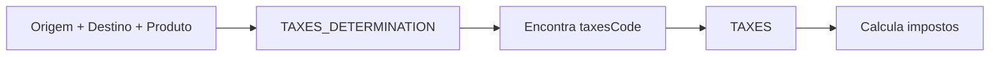

## Visão Geral

As VIEWs de impostos e margens são utilizadas exclusivamente na solução **NEXOFF (Força de Vendas)** para cálculos fiscais e de margem de lucro. Estas VIEWs permitem determinar alíquotas de impostos e margens baseadas em regras de negócio complexas.

<Warning>
  **EXCLUSIVO NEXOFF:** Estas VIEWs são utilizadas apenas por clientes que trabalham com Negociação por Margem e/ou cálculo de impostos no Força de Vendas.
</Warning>

<Note>
  Esta documentação apresenta uma visão simplificada. Para implementação detalhada, consulte a documentação técnica completa ou entre em contato com a equipe Nexfar.
</Note>

---

## VIEWs Disponíveis

### Margem

<Card title="VIEW_NEXFAR_GENERIC_MARGIN_DETERMINATION" icon="chart-line">
  Define as regras de determinação de margem por combinação de parâmetros (cliente, produto, base, etc.)
</Card>

<Card title="VIEW_NEXFAR_GENERIC_MARGIN" icon="percent">
  Contém os valores e configurações de margem a serem aplicados
</Card>

### Impostos

<Card title="VIEW_NEXFAR_GENERIC_TAXES_DETERMINATION" icon="file-invoice-dollar">
  Define as regras de determinação de impostos por combinação de parâmetros
</Card>

<Card title="VIEW_NEXFAR_GENERIC_TAXES" icon="calculator">
  Contém as alíquotas e configurações fiscais a serem aplicadas
</Card>

<Card title="VIEW_NEXFAR_GENERIC_TAXES_BASE_CALC_ST" icon="coins">
  Base de cálculo para Substituição Tributária (ST)
</Card>

---

## Quando Utilizar

### Cálculo de Margem

Utilize as VIEWs de margem quando:

- O cliente trabalha com **Negociação por Margem** no Força de Vendas
- É necessário calcular margem de lucro dinamicamente
- Há regras complexas de margem por estado, cliente ou produto
- É preciso validar margem mínima em pedidos

### Cálculo de Impostos

Utilize as VIEWs de impostos quando:

- O cliente precisa de **cálculo de ST (Substituição Tributária)**
- Há necessidade de cálculo fiscal em tempo real
- Existem regras fiscais específicas por UF, produto ou cliente
- É necessário considerar ICMS, IPI, PIS, COFINS no preço

---

## VIEW_NEXFAR_GENERIC_MARGIN_DETERMINATION

Define em qual contexto uma configuração de margem deve ser aplicada.

### Conceito

Esta VIEW funciona como uma "tabela de decisão" que mapeia combinações de:
- Cliente (por ID, CNPJ, UF ou código de agrupamento)
- Produto (por ID, SKU, fabricante, categoria)
- Base/CD
- Tabela de preço

### Campos Principais

- `marginCode`: Código que identifica a configuração de margem
- `clientMarginCode`: Código de agrupamento de clientes
- `productId`, `productSku`, `productMaker`, `productCategory`: Filtros de produto
- `clientId`, `clientCnpj`, `clientUf`: Filtros de cliente
- `branchId`, `warehouseId`: Filtros de localização
- `priceGroupId`: Filtro de tabela de preço

<Info>
  Campos nulos funcionam como "curinga" (aplicável a todos).
</Info>

---

## VIEW_NEXFAR_GENERIC_MARGIN

Configurações de margem referenciadas pela VIEW de determinação.

### Campos Principais

- `code`: Código único da configuração
- `minMargin`: Margem mínima permitida
- `margin`: Margem padrão
- `maxMargin`: Margem máxima permitida
- Outros campos de configuração de cálculo

---

## VIEW_NEXFAR_GENERIC_TAXES_DETERMINATION

Define em qual contexto uma configuração fiscal deve ser aplicada.

### Conceito

Similar à determinação de margem, mas para regras fiscais:
- Origem e destino (UF)
- Tipo de cliente
- Produto
- Regime tributário

### Campos Principais

- `taxesCode`: Código que identifica a configuração fiscal
- `clientTaxCode`: Código de agrupamento fiscal de clientes
- `originUf`, `destinationUf`: Estados de origem e destino
- Filtros de produto e cliente

---

## VIEW_NEXFAR_GENERIC_TAXES

Configurações fiscais com alíquotas e regras de cálculo.

### Campos Principais

- `code`: Código único da configuração
- Alíquotas de impostos (ICMS, ST, IPI, PIS, COFINS)
- Modos de cálculo
- Reduções de base
- Outras configurações fiscais específicas

---

## VIEW_NEXFAR_GENERIC_TAXES_BASE_CALC_ST

Base de cálculo específica para Substituição Tributária.

### Uso

Fornece valores e percentuais para cálculo correto da ST em operações interestaduais e com produtos sujeitos a substituição tributária.

---

## Fluxo de Cálculo

### Margem

### Impostos

---

## Documentação Detalhada

Para implementação completa destas VIEWs, incluindo todos os campos e regras de negócio:

<CardGroup cols={2}>
  <Card title="Documentação Margem" icon="book" href="https://nexfar.atlassian.net/wiki/spaces/OP/pages/1169424413">
    Cálculo Genérico de Margem (Confluence)
  </Card>

  <Card title="Documentação Taxes" icon="book" href="https://nexfar.atlassian.net/wiki/spaces/OP/pages/TAXES">
    Cálculo Genérico de Impostos (Confluence)
  </Card>
</CardGroup>

---

## Considerações Importantes

<Warning>
  **Complexidade:** Estas VIEWs envolvem lógica fiscal complexa. É altamente recomendado trabalhar em conjunto com a equipe técnica da Nexfar durante a implementação.
</Warning>

<Tip>
  **Testes:** Realize testes extensivos com diferentes combinações de estados, produtos e clientes antes de disponibilizar em produção.
</Tip>

<Note>
  **Atualização:** Alíquotas fiscais mudam frequentemente. Mantenha estas VIEWs atualizadas com a legislação vigente.
</Note>

---

## Próximos Passos

1. [Documentos Fiscais](/integration/deployment/data-extraction/views/documentos-fiscais) - Notas fiscais e documentos
2. Entre em contato com a equipe Nexfar para análise do cenário fiscal
3. Valide regras de margem com a área comercial

<Note>
  Dúvidas sobre implementação? Abra um chamado técnico com a Nexfar.
</Note>
