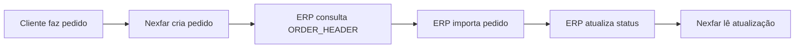
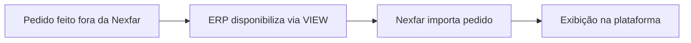

## Visão Geral

As VIEWs de pedidos permitem a integração bidirecional de informações de pedidos entre a plataforma Nexfar e o ERP. Existem dois tipos principais:

- **Pedidos Nexfar** (`ORDER_*`): Pedidos que transitaram pela plataforma Nexfar
- **Pedidos Distribuidor** (`ORDER_DISTRIBUTOR_*`): Pedidos não transitados pela Nexfar (importação externa)

<Note>
  **Importante:** As VIEWs de pedidos servem para **retorno de informações** ao ERP (atualização de status, faturamento, etc.)
</Note>

---

## VIEW_NEXFAR_ORDER_HEADER

Cabeçalhos dos pedidos que transitaram pela Nexfar para integração das informações de retorno.

### Campos Principais

| Campo Nexfar | Descrição | Tipo | Obrigatório |
| --- | --- | --- | --- |
| `transientOrderExternalId` | ID do pedido nas tabelas de integração do ERP | VARCHAR(255) | SIM |
| `orderExternalId` | ID do pedido integrado no ERP | VARCHAR(255) | NÃO |
| `orderNexfarId` | ID do pedido na plataforma Nexfar | INTEGER | NÃO |
| `clientId` | ID do cliente no ERP | VARCHAR(255) | SIM |
| `cnpj` | CNPJ do cliente | VARCHAR(20) | SIM |
| `sellerId` | ID do vendedor | VARCHAR(255) | SIM |
| `status` | Status global do pedido | VARCHAR(255) | SIM |
| `statusLabel` | Substatus (rótulo personalizado) | VARCHAR(255) | NÃO |
| `statusReason` | Motivo do status | VARCHAR(255) | NÃO |
| `orderDate` | Data do pedido | DATE | SIM |
| `billingDate` | Data de faturamento | DATE | NÃO |
| `nfeFileName` | Nome do arquivo XML da NFE | VARCHAR(255) | - |

### Status Possíveis

| Status | Descrição |
| --- | --- |
| `RECEIVED_BY_DISTRIBUTOR` | Pedido processado |
| `BILLED` | Pedido faturado |
| `IN_TRANSIT` | Pedido enviado/em trânsito |
| `DELIVERED` | Pedido entregue |
| `CANCELED` | Pedido cancelado |

<Tip>
  **Campo `statusLabel`:** Use para exibir sub-status personalizados como "Em separação" sem alterar o status principal.
</Tip>

---

## VIEW_NEXFAR_ORDER_ITEM

Itens dos pedidos que transitaram pela Nexfar para integração das informações de retorno.

### Campos Principais

| Campo Nexfar | Descrição | Tipo | Obrigatório |
| --- | --- | --- | --- |
| `transientOrderExternalId` | ID do pedido nas tabelas de integração | VARCHAR(255) | SIM |
| `orderExternalId` | ID do pedido integrado no ERP | VARCHAR(255) | NÃO |
| `orderNexfarId` | ID do pedido na Nexfar | INTEGER | NÃO |
| `productId` | ID do produto no ERP | VARCHAR(20) | NÃO |
| `sku` | SKU do produto | VARCHAR(20) | SIM |
| `quantityRequested` | Quantidade solicitada | INTEGER | SIM |
| `quantityAttended` | Quantidade atendida | INTEGER | SIM |
| `statusReason` | Motivo do não atendimento | VARCHAR(255) | NÃO |
| `subsidized` | É item bonificado? | BOOLEAN | SIM |
| `returned` | Produto foi devolvido? | BOOLEAN | NÃO |
| `returnedDate` | Data da devolução | DATE | NÃO |
| `returnedQuantity` | Quantidade devolvida | INTEGER | NÃO |
| `returnedReason` | Motivo da devolução | VARCHAR(255) | NÃO |
| `price` | Preço sem imposto | NUMERIC(10,2) | SIM |
| `finalPrice` | Preço com ST | NUMERIC(10,2) | SIM |

<Info>
  **Campo `finalPrice`:** Se não houver ST, enviar `finalPrice = price`.
</Info>

---

## VIEW_NEXFAR_ORDER_RETURNED_ITEM

Itens devolvidos nos pedidos para integração das informações de devolução.

### Campos Principais

| Campo Nexfar | Descrição | Tipo | Obrigatório |
| --- | --- | --- | --- |
| `orderId` | ID do pedido Nexfar | INTEGER | SIM |
| `productId` | ID do produto no ERP | INTEGER | SIM |
| `sku` | SKU do produto | INTEGER | SIM |
| `returnedQuantity` | Quantidade devolvida | INTEGER | SIM |
| `returnedDate` | Data da devolução | DATE | SIM |
| `subsidized` | É item bonificado? | BOOLEAN | SIM |

<Warning>
  Esta VIEW é específica para registros de devolução e requer o ID do pedido Nexfar.
</Warning>

---

## VIEW_NEXFAR_ORDER_DISTRIBUTOR_HEADER

Cabeçalhos para importação de pedidos **não transitados** pela Nexfar.

<Warning>
  **VIEW NÃO PADRÃO:** Deve ser implementada apenas para clientes com acordo específico para importação de pedidos externos.
</Warning>

### Campos Principais

| Campo Nexfar | Descrição | Tipo | Obrigatório |
| --- | --- | --- | --- |
| `orderExternalId` | ID do pedido no ERP | VARCHAR(255) | SIM |
| `branchId` | ID da Base | VARCHAR(255) | SIM |
| `clientId` | ID do cliente no ERP | VARCHAR(255) | SIM |
| `cnpj` | CNPJ do cliente | VARCHAR(20) | SIM |
| `priceGroupId` | ID da tabela de preço | VARCHAR(20) | SIM |
| `warehouseId` | ID do Centro de Distribuição | VARCHAR(255) | SIM |
| `sellerId` | ID do vendedor | VARCHAR(255) | SIM |
| `paymentConditionId` | ID da condição de pagamento | VARCHAR(255) | SIM |
| `status` | Status global do pedido | VARCHAR(255) | SIM |
| `statusLabel` | Substatus personalizado | VARCHAR(255) | NÃO |
| `statusReason` | Motivo do status | VARCHAR(255) | NÃO |
| `paymentStatus` | Status de pagamento | VARCHAR(255) | NÃO |
| `orderDate` | Data do pedido | DATE | SIM |
| `billingDate` | Data de faturamento | DATE | NÃO |
| `nfeNumber` | Número da nota fiscal | INTEGER | NÃO |
| `nfeKey` | Chave da nota fiscal | VARCHAR(255) | NÃO |

### Status de Pagamento

| Status | Descrição |
| --- | --- |
| `UNDEFINED` | Indefinido |
| `PENDING_PAYMENT` | Pagamento pendente |
| `PAID` | Pago |

---

## VIEW_NEXFAR_ORDER_DISTRIBUTOR_ITEM

Itens para importação de pedidos **não transitados** pela Nexfar.

<Warning>
  **VIEW NÃO PADRÃO:** Deve ser implementada apenas para clientes com acordo específico.
</Warning>

### Campos Principais

| Campo Nexfar | Descrição | Tipo | Obrigatório |
| --- | --- | --- | --- |
| `orderExternalId` | ID do pedido no ERP | VARCHAR(255) | SIM |
| `productId` | ID do produto no ERP | VARCHAR(20) | SIM |
| `sku` | SKU do produto | VARCHAR(20) | NÃO |
| `priceGroupId` | ID da tabela de preço | VARCHAR(20) | SIM |
| `quantityRequested` | Quantidade solicitada | INTEGER | SIM |
| `quantityAttended` | Quantidade atendida | INTEGER | SIM |
| `subsidized` | É item bonificado? | BOOLEAN | SIM |
| `statusReason` | Situação do item | VARCHAR(255) | NÃO |
| `price` | Preço sem imposto | NUMERIC(10,2) | SIM |
| `finalPrice` | Preço com ST | NUMERIC(10,2) | SIM |
| `industryPrice` | Preço fábrica | NUMERIC(10,2) | NÃO |
| `discount` | Desconto sobre preço fábrica | NUMERIC(10,2) | NÃO |
| `sellerKickback` | Comissão do vendedor | NUMERIC(10,2) | NÃO |

---

## Fluxo de Integração

### Pedidos Nexfar (ORDER)



1. Cliente realiza pedido na plataforma Nexfar
2. Nexfar disponibiliza dados na VIEW_NEXFAR_ORDER_HEADER/ITEM
3. ERP consulta as VIEWs e importa o pedido
4. ERP atualiza status (processamento, faturamento, envio)
5. Nexfar lê atualizações e notifica cliente

### Pedidos Distribuidor (ORDER_DISTRIBUTOR)



1. Pedido realizado por outros canais (telefone, vendedor externo, etc.)
2. ERP disponibiliza pedido na VIEW_NEXFAR_ORDER_DISTRIBUTOR
3. Nexfar importa e exibe na plataforma
4. Cliente visualiza histórico unificado

---

## Exemplo de Consulta SQL

```sql
-- Exemplo: VIEW_NEXFAR_ORDER_HEADER
CREATE VIEW VIEW_NEXFAR_ORDER_HEADER AS
SELECT
    p.id_transiente AS transientOrderExternalId,
    p.id_erp AS orderExternalId,
    p.id_nexfar AS orderNexfarId,
    c.id_erp AS clientId,
    c.cnpj AS cnpj,
    v.id_erp AS sellerId,
    CASE
        WHEN p.status = 'PROCESSADO' THEN 'RECEIVED_BY_DISTRIBUTOR'
        WHEN p.status = 'FATURADO' THEN 'BILLED'
        WHEN p.status = 'ENVIADO' THEN 'IN_TRANSIT'
        WHEN p.status = 'ENTREGUE' THEN 'DELIVERED'
        WHEN p.status = 'CANCELADO' THEN 'CANCELED'
    END AS status,
    p.data_pedido AS orderDate,
    p.data_faturamento AS billingDate,
    p.arquivo_nfe AS nfeFileName
FROM pedidos_nexfar p
INNER JOIN clientes c ON p.id_cliente = c.id
INNER JOIN vendedores v ON p.id_vendedor = v.id;
```

---

## Próximos Passos

Após implementar as VIEWs de pedidos, prossiga para:

1. [Vendas](/deployment/data-extraction/views/vendas) - Ações comerciais e ofertas
2. [Documentos Fiscais](/deployment/data-extraction/views/documentos-fiscais) - Notas fiscais e documentos
3. [Combos](/deployment/data-extraction/views/combos) - Promoções e combos

<Note>
  **Dúvidas sobre fluxo de pedidos?** Entre em contato com a equipe técnica da Nexfar para alinhar o processo de integração.
</Note>
